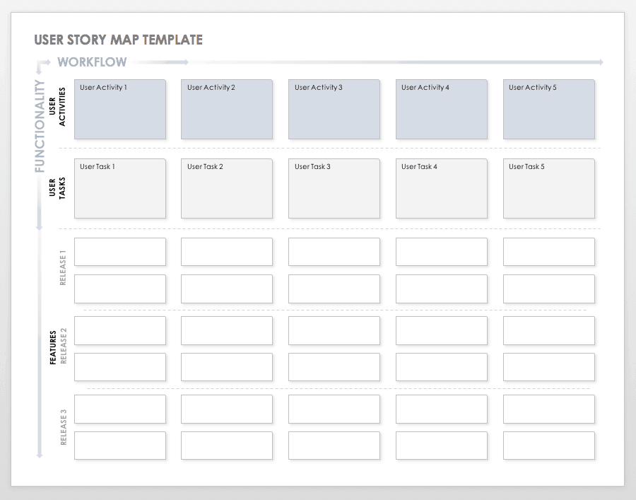

# Delivering Value - Focus on the business cases and users then work your way down to technicals.

When any project starts -- even a protocol, some end use cases are always defined.

So we should begin at defining who the user is.

Given we have some understanding about who we are building for

When we start to architect the system

Then we are able to frame our solutions to fit those users.

---

How does this apply to techncial projects like protocols -- whos end user just care about the techncial aspects?

Why should I as a protocol engineer even have to 

Well a protocol would begin with some specification -- 

Why is this new protocol necessary?

How is it going to be used?

How is it going to be implemented?

What value does it bring?

- Now this is exactly where the user comes into play.

Users vs Community

- Different kinds of users make up a community

Technical, Design, Business

Technical Movigations

# Get alignment through a design sprint

#### Happy Flows / Unhappy Flows

Dont forget happy flow --

#### Sprint Planning & Backlog Grooming

> Experienced Scrum Teams spend time and effort to break down large PBI’s into smaller stories. Although they sometimes do this during the planning of a new sprint, they have learned that this process of ‘refinement’ should be continuous in order to make sprints — and particularly sprint planning — run smoother.

**Source** -- https://medium.com/the-liberators/10-powerful-strategies-for-breaking-down-user-stories-in-scrum-with-cheatsheet-2cd9aae7d0eb

